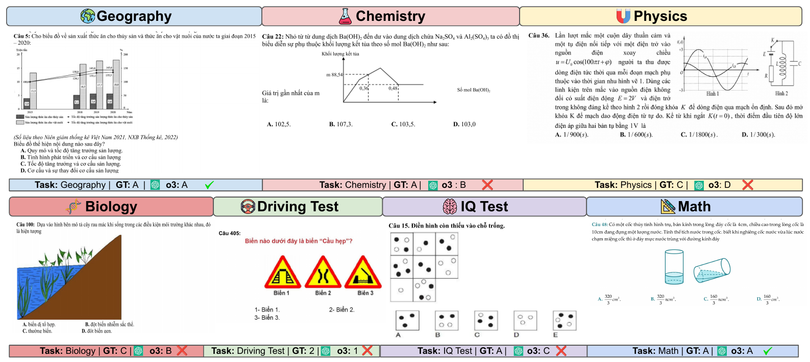

# VMMU: A Vietnamese Multitask Multimodal Understanding and Reasoning Benchmark

<div align="center">
  <p style="font-size: 20px;">by
    <a href="https://www.linkedin.com/in/dang-thi-tuong-vy-00a357278/">Vy Tuong Dang</a><sup>1*</sup>,
    <a href="https://anvo.me">An Vo</a><sup>3*‡</sup>,
    <a href="https://villacu.github.io/">Emilio Villa-Cueva</a><sup>2</sup>,<br>
    <a href="https://www.linkedin.com/in/quang-tau-a708b4238/">Quang Tau</a><sup>1</sup>,
    <a href="https://minhducdo050702.github.io">Duc Dm</a><sup>1</sup>,
    <a href="https://mbzuai.ac.ae/study/faculty/thamar-solorio/">Thamar Solorio</a><sup>2</sup>,
    <a href="https://www.resl.kaist.ac.kr/members/director">Daeyoung Kim</a><sup>1</sup>
  </p>
  <p>
    <sup>*</sup>Equal contribution &nbsp;&nbsp; <sup>‡</sup>Work done while at MBZUAI and KAIST<br>
    <sup>1</sup>KAIST, <sup>2</sup>MBZUAI, <sup>3</sup>University of Michigan
  </p>

  <h3>Findings of the Association for Computational Linguistics: AACL-IJCNLP 2026</h3>

[](https://vmmu-bench.github.io/)
[](https://arxiv.org/abs/2508.13680)
[](https://huggingface.co/datasets/anvo25/vmmu)

</div>

---

## Abstract

<p align="center">
  
</p>

*Vision language models are predominantly evaluated on English-centric multimodal benchmarks, leaving their behavior in other languages and cultures insufficiently understood. We introduce **VMMU**, a Vietnamese Multitask Multimodal Understanding and Reasoning benchmark of **2,548 multiple-choice questions** across seven domains: Mathematics, Physics, Chemistry, Biology, Geography, Driving Test, and IQ Test. Every question requires jointly reasoning over Vietnamese text and non-text visual evidence (charts, diagrams, tables, traffic scenes), and is distributed as a single rendered page image. We evaluate 10 open-source and 5 closed-source VLMs on VMMU. Test-time compute improves performance from **57%** to **78%** accuracy, but it remains inferior to an expert baseline (**99%** accuracy). Extensive error analyses show that closed-source VLMs already achieve strong Vietnamese OCR performance, yet still struggle on VMMU. This suggests that the primary bottleneck is **multimodal grounding and reasoning** rather than text recognition or Vietnamese language understanding.*

---

## 1. Dataset

2,548 questions in seven domains. Each question is a single image with the Vietnamese question text, the answer options, and the visual evidence.

| Domain | `subject` | Questions |
|---|---|---:|
| Mathematics | `Math` | 456 |
| Physics | `Physics` | 361 |
| Chemistry | `Chemistry` | 302 |
| Biology | `Biology` | 341 |
| Geography | `Geography` | 481 |
| Driving Test | `DrivingTest` | 367 |
| IQ Test | `IQTest` | 240 |

```python
from datasets import load_dataset

vmmu = load_dataset("anvo25/vmmu", split="full_vqa")
```

See the [dataset card](https://huggingface.co/datasets/anvo25/vmmu) for all splits and fields.

---

## 2. Evaluate a model

### 2.1 Install

```bash
git clone https://github.com/vytuongdang/VMMU.git
cd VMMU
pip install -r requirements.txt
```

Set the API key of your provider as an environment variable (`OPENAI_API_KEY`, `ANTHROPIC_API_KEY`, `OPENROUTER_API_KEY`, `GEMINI_API_KEY`, or `COHERE_API_KEY`), or put it in its file under `api_key/`.

### 2.2 Run

The dataset is downloaded from Hugging Face on the first run, and the API provider is picked from the model name, so only `--model` changes between models:

```bash
# Evaluate single model
python api_code/main_api.py \
  --model o3-2025-04-16 \
  --split full_vqa \
  --prompt_language vn

python api_code/main_api.py --model claude-sonnet-4-20250514 --split full_vqa --prompt_language vn
python api_code/main_api.py --model google/gemini-2.5-flash --split full_vqa --prompt_language vn
python api_code/main_api.py --model qwen/qwen2.5-vl-72b-instruct --split full_vqa --prompt_language vn

# Cross-lingual evaluation
python api_code/main_api.py \
  --model gpt-4.1-2025-04-14 \
  --split full_vqa \
  --prompt_language en

# Quick test on the first 5 questions
python api_code/main_api.py --model gpt-4.1-2025-04-14 --split random_subset_vqa --test 5
```

Available splits: `full_vqa`, `random_subset_vqa`, `random_subset_ocr`, `cropped_random_subset_vqa`, `cropped_random_subset_vqa_description` (the `cropped_*` splits only have Vietnamese prompts).

Results are saved to `results/<model>/<split>_<prompt_language>.json`; running the same command again only retries missing questions. When the run finishes, the accuracy is printed right away:

```
o3-2025-04-16 | full_vqa_vn.json | 2548 questions
|Subject     |    N| Extraction| Accuracy|
|------------|-----|-----------|---------|
|Math        |  456|        ...|      ...|
|...         |     |           |         |
|Overall     | 2548|        ...|      ...|
|Mean        |     |        ...|      ...|
```

Other options: `--provider` (force `openai` / `claude` / `gemini` / `openrouter` / `aya`), `--reasoning-effort` (o3, gpt-5, claude-opus-4-6), `--temperature`, `--concurrency`, `--openrouter-ignore-providers`, `--input-file` (local metadata JSON instead of `--split`), `--output-dir`. See `python api_code/main_api.py --help`.

### 2.3 Compare models

```bash
python src/result.py
```

Prints the extraction-rate and accuracy tables of all models in `results/` and saves them to `results/analysis_<split>_<prompt_language>.csv`.

---

## 3. Build the dataset from scratch

The tools in [`src/`](src/) turn exam PDFs into verified questions:

| Step | Tool | Output |
|---|---|---|
| 1. Render | [`convert_pdf_to_image.py`](src/convert_pdf_to_image.py) | one image per exam page |
| 2. Cut | [`cut_question.py`](src/cut_question.py) | one image per question (question boundary detection) |
| 3. Select | [`choose_question.html`](src/choose_question.html) | filtered, selected questions |
| 4. Verify | [`check_question.html`](src/check_question.html) | manually verified questions |
| 5. OCR ground truth | [`ocr_ground_truth.html`](src/ocr_ground_truth.html) | edited OCR transcriptions for the OCR subset |

The `.html` tools run in the browser.

---

## 4. Repository structure

```
api_code/          evaluation: one handler per API provider, main_api.py
api_key/           API keys (or use environment variables)
src/               data pipeline, annotation tools, result.py
vmmu_dataset.py    loads a split from Hugging Face and caches its images in dataset/
images/            README figures
```

---

## Citation

```bibtex
@inproceedings{dang2026vmmu,
  title     = {{VMMU}: A Vietnamese Multitask Multimodal Understanding and Reasoning Benchmark},
  author    = {Dang, Vy Tuong and Vo, An and Villa-Cueva, Emilio and Tau, Quang and Dm, Duc and Solorio, Thamar and Kim, Daeyoung},
  booktitle = {Findings of the Association for Computational Linguistics: AACL-IJCNLP 2026},
  year      = {2026},
  url       = {https://arxiv.org/abs/2508.13680}
}
```
